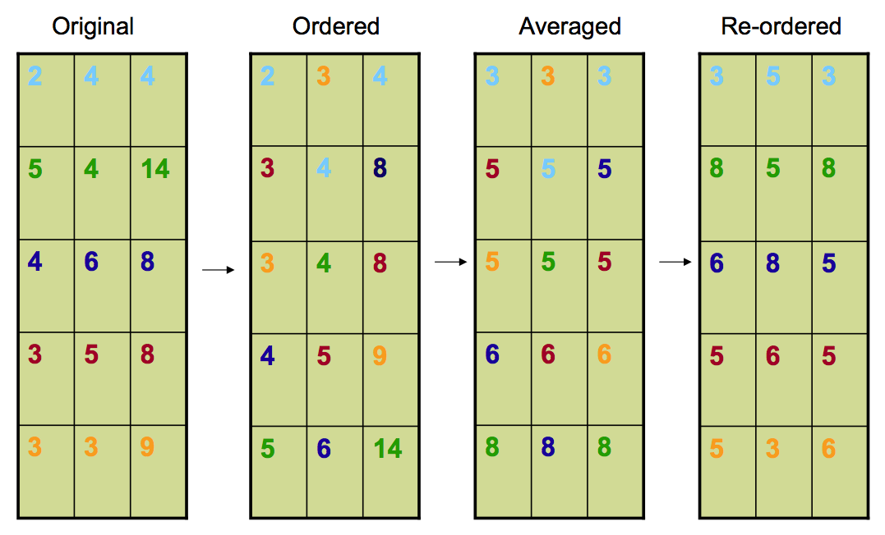

## Motivation: raw genomics data is noisy

<center></center>

[Jaffe AE. FlowSorted.Blood.450k: Bioconductor R package version 1.2.0.](http://www.bioconductor.org/packages/release/data/experiment/html/FlowSorted.Blood.450k.html)

<!---
* Study performed to determine if whole blood is a valid source for DNA methylation analysis
* Raw beta values for 35 
* 10 cell populations, 6 healthy male blood donors (age 38 + 13.6yrs)
* Flow cytometry was used to sort the cell populations (avg purities from 81-97$\%$)
* DNA methylation levels were analyzed on $n$ = 60 samples on Illumina Infinium 450K arrays to compare cell populations and identify differentially methylated CpG sites unique to each cell type
* The problem is flow cytometry can be very costly in both the amount of blood needed and the work it takes to tag the antibodies. 
-->


---

## Motivation: raw genomics data is noisy

<center></center>

[Jaffe AE. FlowSorted.Blood.450k: Bioconductor R package version 1.2.0.](http://www.bioconductor.org/packages/release/data/experiment/html/FlowSorted.Blood.450k.html)


---


## Quantile normalization
quantile normalization = a non-linear transformation that replaces each intensity score with the mean of the features with the same rank from each array


<center></center>
<br><br>

Taken from [The Expressionists Seminar (JHU)](http://astor.som.jhmi.edu/hex/Arrays/add/material/expressionist_series_4.pdf)


<!--- 

order value in each array
take average across all probes
substitute probe intensity with average
put in original order

-->


---

## Back to motivating example

<center></center>

<!--- How different are these 36 distributions? Variability within and between groups? -->

---


## Back to motivating example (quantile normalized)

<center></center>

<!--- ``In the parts of the distribution with few values (and therefore relatively large interquantile differences), it may introduce considerable changes. The danger is that these large changes could increase the variance across samples for individual features, rather than reducing it as desired."  [Pidsley et al. (2013)]

"It forces the distributions of gene expressions to be essentially identical across samples; this assumption is justified in gene expression studies where only a few genes are expected to be differentially expressed across the samples.? [Jean-Phillpe]  -->


---

## quantro: an "ANOVA" on quantile distributions
#### Test for global differences in distributions across groups


<center>$\int (F_{ik}^{-1}(u) - \bar{F}_{\cdot \cdot}^{-1}(u))^2 du = \int (\bar{F}_{\cdot k}^{-1}(u) - \bar{F}_{\cdot \cdot}^{-1}(u))^2 du + \int (F_{ik}^{-1}(u) - \bar{F}_{\cdot k}^{-1}(u))^2 du$</center>

where 

<center>$F_{ik}^{-1}(u)$ = quantile distribution for $i^{th}$ sample, $k^{th}$ group, $u \in (0, 1)$</center>

and 

<center>$\bar{F}_{\cdot k} =\frac{1}{n_k} \sum_{i = 1}^{n_k} F_{ik} \text{ and } \bar{F}_{\cdot \cdot} = \frac{1}{d} \frac{1}{n_k} \sum_{k = 1}^{d} \sum_{i = 1}^{n_k} F_{ik}$</center>

Sum over all $i$ samples in $k$ groups $\Rightarrow$ $\text{SS}_{total} = \text{ SS}_{between} + \text{ SS}_{within}$

Then, 
<center>$F_{quantro} = \frac{MS_{between}}{MS_{within}} = \frac{ SS_{between} / (d - 1)  }{ SS_{within}/ (n_T - d)}$</center>

Use permutation testing to assess statistical significance

---


## Using quantro: installation


```r
library(devtools)
install_github("quantro", "stephaniehicks")
```

---

## Using quantro: preprocess raw data


```r
library(minfi)

Mset <- preprocessRaw(FlowSorted.Blood.450k)
pd <- pData(Mset)
p <- getBeta(Mset, offset = 100)
```


---


## Using quantro: preprocess raw data


```r
library(minfi)

Mset <- preprocessRaw(FlowSorted.Blood.450k)
pd <- pData(Mset)
p <- getBeta(Mset, offset = 100)
```

    > dim(p)
    [1] 485512     36
    >
    > head(pd)
        Sample_Name   CellTypeLong  Group
        Gran_105      Granulocytes  Gran
        Gran_218      Granulocytes  Gran
        Gran_261      Granulocytes  Gran
        CD4+_105      CD4+ T-cells  CD4T
        CD4+_218      CD4+ T-cells  CD4T
        CD4+_261      CD4+ T-cells  CD4T


---

## Using quantro


```r
library(quantro)
library(doParallel)
registerDoParallel(cores=4) # for permutation testing
qtest <- quantro(p, pd, B=1000)
```

---

## Using quantro


```r
library(quantro)
library(doParallel)
registerDoParallel(cores=4) # for permutation testing
qtest <- quantro(p, pd, B=1000)
```

    > qtest
    quantro: Test for global diffferences in distributions
       nGroups:  6 
       nTotSamples:  36 
       nSamplesinGroups:  6 6 6 6 6 6 
       mediansANOVAPval:  0.03994
       quantroStat:  6.69062
       quantroPvalPerm:  0 


---


## Plotting results of permutation test


```r
quantroPlot(qtest)
```

<center></center>


---


## Targeted vs Global differences in distributions

<center></center>


